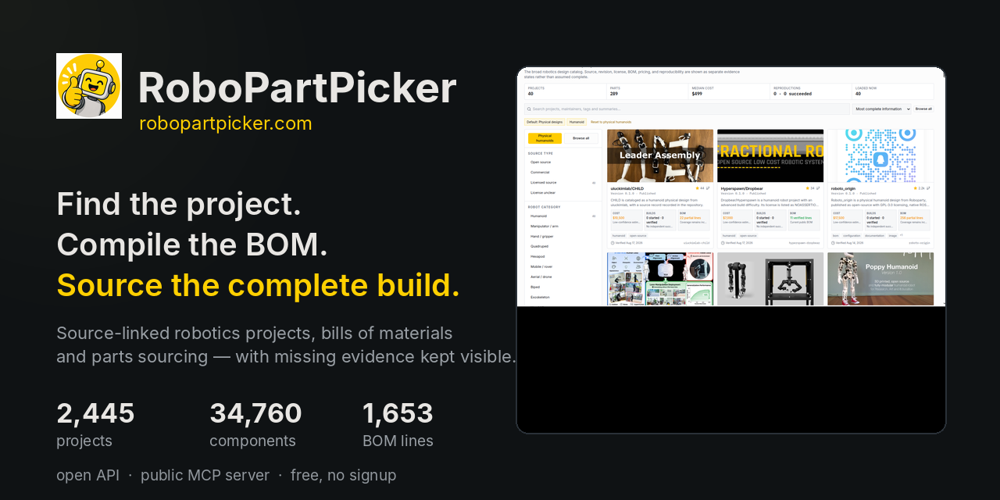
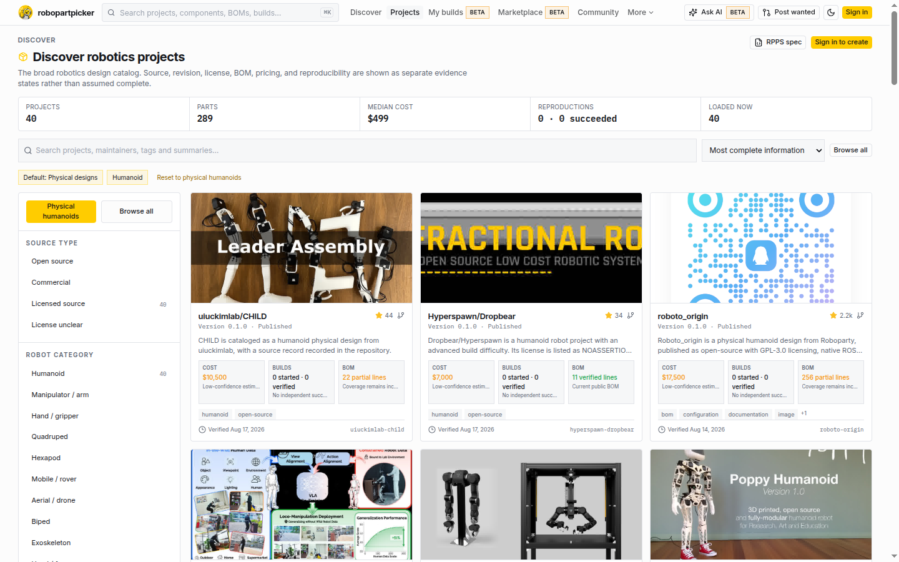
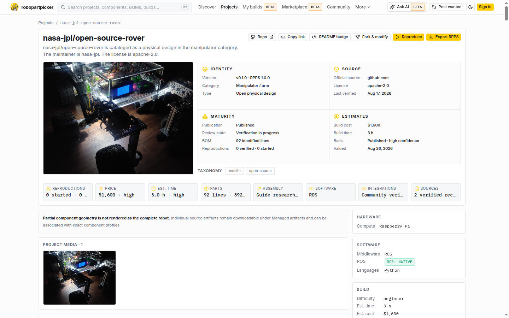
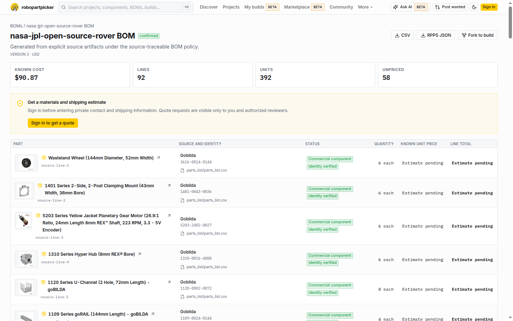
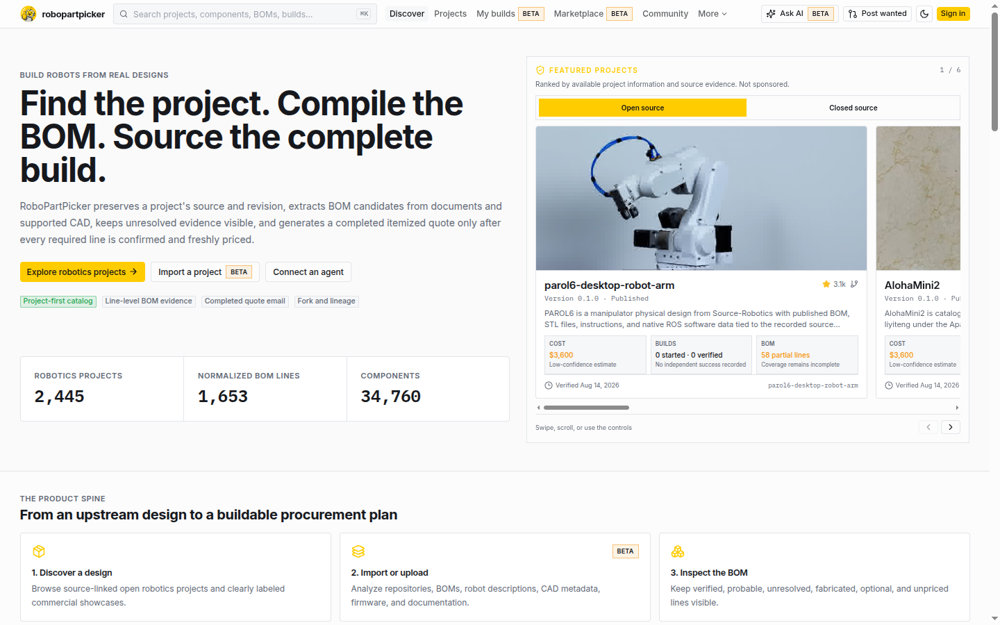

<div align="center">



<br>

**Find the project. Compile the BOM. Source the complete build.**

Source-linked robotics project discovery, bill-of-materials compilation and parts sourcing —
with missing evidence kept visible instead of guessed.

[](https://robopartpicker.com)
[](https://github.com/brainbook0/robopartpicker/actions/workflows/ci.yml)
[](https://registry.modelcontextprotocol.io/v0/servers?search=com.robopartpicker)
[](https://workers.cloudflare.com/)

</div>

---

RoboPartPicker treats a robot build the way PCPartPicker treats a PC build. You point it at an
open robotics design; it reads the repository, compiles the bill of materials from the project's
own artifacts, matches each line to a canonical component, and shows what the build actually
costs — including the lines it could not resolve.

It currently indexes **2,445 published robotics projects**, **34,760 components** and **1,653
normalized BOM lines** across open hardware, robotics software and manufacturer showcases.

## Screenshots

**Discover** — server-ranked by information completeness, filterable by source type, robot
category, licence, ROS support, BOM evidence and price range.



**Project** — upstream source, revision, licence, BOM line count, and cost/time estimates, each
with its evidence basis.



**Bill of materials** — every line keeps its source locator, supplier identity and verification
state. Unpriced lines stay visible rather than being quietly dropped.



**Home** — a completeness-ranked featured rail over live catalog metrics.



## What it does

- **Discovers designs.** Every project keeps its upstream source, maintainer, revision, licence
  and verification freshness attached.
- **Compiles BOMs from evidence.** Explicit BOM files (CSV, TSV, XLSX, Markdown, HTML, JSON,
  YAML, XML, KiCad), plus project documentation, URDF/robot-description files and CAD metadata.
  Every source object is accounted for and every line keeps an evidence locator.
- **Normalizes component identity.** Aggregates only on exact manufacturer-plus-part-number
  matches, so two similarly named parts are never silently merged.
- **Sources the build.** Observed supplier prices, offer coverage and a sourcing estimate that
  shows which lines block a complete build.
- **Serves machines as well as people.** A public read-only HTTP API and an MCP server, so an
  agent can search projects, pull BOMs and compare components directly.

## For agents

A public, read-only MCP server is live — no auth, no install:

```json
{
  "mcpServers": {
    "robopartpicker": {
      "type": "streamable-http",
      "url": "https://robopartpicker.com/mcp"
    }
  }
}
```

Tools: `search_projects`, `get_project`, `search_components`, `compare_components`,
`validate_rpps`. Published to the official registry as `com.robopartpicker/robopartpicker`;
client config and install notes live in
[robopartpicker-mcp](https://github.com/brainbook0/robopartpicker-mcp).

| | |
|---|---|
| API base | `https://robopartpicker.com/api/v1` |
| OpenAPI 3.1 | `https://robopartpicker.com/openapi.json` |
| MCP discovery | `https://robopartpicker.com/.well-known/mcp.json` |
| Developer docs | `https://robopartpicker.com/developers` |
| `llms.txt` | `https://robopartpicker.com/llms.txt` |

## Data honesty

This is the part most catalogs get wrong, so it is stated plainly:

- **An observed price is an observation, not a quote.** Supplier coverage is partial and prices
  drift, and the catalog says so wherever a price appears.
- **Unresolved lines stay visible.** A BOM line that cannot be matched to a commercial identity
  is labelled unresolved or unpriced. It is never dropped and never replaced with a guess,
  because a build plan that hides its gaps is worse than one that shows them.
- **Software projects and manufacturer showcases are labelled as such.** A commercial robot with
  no manufacturer BOM reports that state rather than inventing parts.
- **No synthetic activity.** No seeded reviews, invented users, fake build counts or manufactured
  traffic anywhere in this product or its data.
- **Upstream rights are respected.** Projects, CAD, firmware, documentation and images remain
  under their own licences; a RoboPartPicker record grants no rights beyond them.

## Product surfaces

| Surface | Purpose | Status |
| --- | --- | --- |
| Projects | Discover, import, publish, inspect, reproduce, fork | Live |
| BOMs | Versioned bills of materials with line-level completeness and evidence | Live, corpus coverage growing |
| Sourcing | Whole-BOM estimated baskets with constraints and unpriced lines | Live estimates |
| Components | Canonical parts, specifications, revisions, media, offers | Live |
| Build workspace | Persistent reproductions and BOM decisions | Live |
| Marketplace | Parts, robots, fabrication, services, wanted requests | Live listings, no platform payments |
| Public MCP | Read-only project/component/BOM data for external agents | Live at `/mcp` |
| Private MCP | OAuth-scoped actions with confirmation gates | Live at `/mcp/private` |
| Firm supplier quotes | RFQ package and response reconciliation | Workflow live, outbound delivery integration-dependent |

## Stack

| Layer | Choice |
|---|---|
| Edge runtime | Cloudflare Workers (`run_worker_first`, streamable-HTTP MCP) |
| Data | Cloudflare D1 (sequential SQL migrations) + R2 (content-addressed media) |
| Frontend | React + Vite + TypeScript + Tailwind, Hono on the Worker |
| Server rendering | Worker-injected prerender for crawlers, with an app cleanup handoff |
| AI | Source-cited description generation with immutable model/prompt/source fingerprints |
| Tests | Vitest — 677 unit tests, 72 worker/integration tests |

## Local development

Requires Node.js 22 or newer.

```bash
npm ci --include=dev          # see the note below
cp .dev.vars.example .dev.vars
npm run db:migrate:local
npm run dev                   # http://127.0.0.1:8080
```

> **Note:** if `NODE_ENV=production` is exported in your shell, npm omits devDependencies and you
> lose `wrangler`, `vitest`, `cross-env` and the Vite plugins. Use `npm ci --include=dev` or
> unset `NODE_ENV` first.

Local variables required: `BETTER_AUTH_SECRET`, `BETTER_AUTH_URL`, `INGESTION_SECRET`. Email,
Google sign-in, AI, malware scanning and outbound supplier delivery are optional integration
boundaries — when absent they must produce an explicit unavailable or draft-only state, never a
silent success.

Migrations are sequential and immutable once applied; schema changes ship as new migrations.
Runtime data access goes through the `DB` and `FILES` bindings only — never a local database
file — and browser code talks to the same-origin `/api/*` surface without importing Worker
internals or secrets.

## Quality and verification

```bash
npm run typecheck        # tsc -b
npm run lint
npm run contracts:validate
npm run test             # unit + worker suites
npm run build            # production bundle
npm run check            # all of the above
```

A feature is not complete because a card renders. Public workflows must load real records,
preserve uncertainty, cross API and storage boundaries, and fail honestly.

## Repository layout

```
worker/        Cloudflare Worker: routes, D1 repositories, SEO and MCP services
src/           React frontend, shared types, generated data (queries, glossary, comparisons)
migrations/    Sequential D1 schema migrations
contracts/     Versioned machine-readable ingestion schemas
standards/rpps Vendor-neutral RPPS draft, examples and conformance profiles
scripts/       Ingestion, publication, audit and verification tooling
tests/         Worker integration tests
docs/          Architecture, schema, ingestion contract, deployment, screenshots
```

Detailed references: [backend architecture](docs/backend-architecture.md) ·
[database schema](docs/database-schema.md) · [ingestion contract](docs/data-ingestion-contract.md) ·
[deployment](docs/deployment.md) · [local development](docs/local-development.md) ·
[MCP](docs/mcp.md) · [RPPS draft](standards/rpps/README.md).

## Contributing

Catalog corrections are the most valuable contribution right now — a wrong price, a missing
supplier, a BOM line that should have matched, a project that should not be listed. Open an
issue with the URL and what you expected to see.

Engineering contributions: keep the honesty rules intact, add a failing test before production
logic where practical, and run `npm run typecheck && npm test` before opening a pull request.
[`AGENTS.md`](AGENTS.md) documents the architecture invariants the codebase is expected to
preserve.

## License and status

No licence is granted for reuse of this source at this time. It is published for transparency
and review, which is consistent with the [intellectual property
policy](https://robopartpicker.com/intellectual-property) the live product publishes: the brand,
interface, original text, software and data organization remain protected, and no trademark
licence is granted. Robotics project data returned by the API stays under each upstream
project's own licence.

If you want to reuse or fork this code, open an issue and we will answer explicitly rather than
leaving it ambiguous.

RPPS 0.1 is a portable draft, not an established industry standard or engineering certification.
