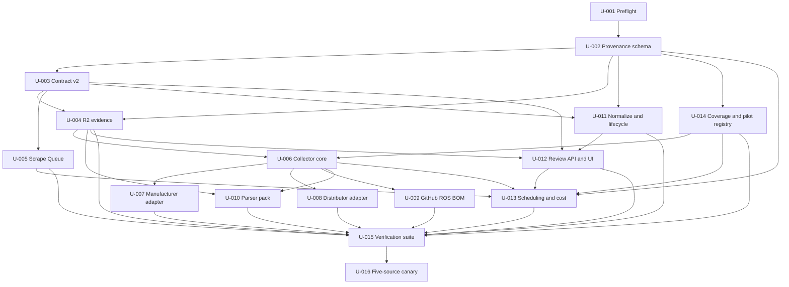

# RoboPartPicker Provenance-First Data Collection Plan

## Goal Capsule

Design an implementation-ready, evidence-backed system that can collect raw source material and structured robotics records across the complete 1,694-line RoboPartPicker inventory while preserving provenance, field confidence, claim classification, revisions, conflicts, withdrawals, and source-policy state. The pilot must use the existing Cloudflare Worker, D1, R2, Queue, review, and audit boundaries, with external crawlers and heavy parsers submitting bounded batches. It must prove five representative allowed sources within a hard USD 50 monthly incremental budget before broader rollout.

The trust promise is: every value can be traced to the exact source, retrieval, applicable revision, extraction method, and evidence classification, and uncertain or missing data is never disguised as fact.

## Product Contract

### Actors and end-to-end flows

1. **Data operator** registers a source, selects an approved access method, records policy and reuse status, assigns cadence and budgets, and enables it only after preflight.
2. **External acquisition worker** discovers permitted resources, honors budgets and conditional requests, stores or references immutable raw evidence, and emits content-addressed work.
3. **Extractor** produces typed records and per-field claims with evidence locators, confidence, normalized values, and explicit provenance classification.
4. **Cloudflare ingestion boundary** authenticates the service, validates the versioned contract, deduplicates records, stores raw evidence metadata, stages normalized data, and generates match or conflict candidates.
5. **Administrator or allowlisted policy** reviews the exact evidence and proposed mutation, then approves, rejects, defers, or records a conflict without losing history.
6. **Catalog consumers** receive current canonical views while internal or versioned APIs expose provenance, revisions, freshness, conflicts, and withdrawal state.
7. **Operator** monitors freshness debt, source failures, cost, retries, dead letters, extraction quality, review backlog, and policy violations, and can pause one source without stopping independent sources.

### In scope

- Universal provenance, claim-level confidence and evidence classification, immutable raw snapshots or references, content hashes, and revision-aware history.
- A source registry and policy engine covering access method, robots and terms state, copyright or reuse, cadence, rate, cost, locale, and lifecycle.
- Versioned external ingestion contracts and additive D1 schema evolution that preserve current ingestion and project-import behavior.
- External adapter framework for APIs, feeds, permitted HTTP pages, repositories, bounded files, documents, and volatile offers.
- Worker-side validation, staging, deterministic matching, conflict detection, review, promotion, audit, withdrawal, and observability.
- Five-source pilot covering manufacturer, distributor, repository, ROS or BOM file, and volatile offer or stock data.
- Roadmap coverage for every inventory section and source family, including explicit deferments for policy, cost, unsupported formats, or low confidence.

### Initial rollout waves

1. **Wave 0, safety and provenance substrate:** source registry, policy gates, immutable snapshots, universal provenance, field claims, time series, conflicts, withdrawals, budgets, and contract v2.
2. **Wave 1, structured pilot:** one official manufacturer and one structured distributor or catalog source, including component, offer, price, and stock observations.
3. **Wave 2, repository and BOM pilot:** one GitHub or GitLab project plus ROS, BOM, documentation, release, software, firmware, and bounded relevant file ingestion.
4. **Wave 3, safe robotics formats:** URDF, Xacro, SDF, SRDF, MJCF, CAD and mesh metadata, and fail-closed unsupported native files.
5. **Wave 4, volatile marketplaces and supplier observations:** only sources with approved interfaces and policy, using aggressive time-series, seller, condition, and confidence controls.
6. **Wave 5, community and build evidence:** forums, ROS Discourse, Hackaday, Instructables, reproductions, substitutions, build logs, corrections, and supplier reports after reuse policy and moderation are proven.
7. **Wave 6, media, teardown, and publications:** transcripts, images, FCC evidence, papers, reports, benchmarks, OCR or vision extraction, and stricter copyright and inference review.
8. **Wave 7, compatibility and normalization expansion:** interface taxonomies, unit and currency normalization, compatibility rules, alternatives, and evidence-backed substitution outcomes across accumulated data.

### Success thresholds

- Five allowed pilot sources complete the full raw-to-reviewed-canonical lifecycle.
- Every accepted pilot record has all required universal provenance fields.
- Every extracted pilot field has evidence classification and confidence; AI-derived values are explicitly AI-inferred.
- Idempotent replay creates no duplicate import, observation, canonical, or audit facts.
- Prices, stock, and at least one mutable specification are demonstrated as time-series or revision-aware values.
- One conflict, one withdrawal, one missing-information state, one denied-source state, and one unsupported-file state are exercised with preserved history.
- No external process writes canonical rows directly.
- Incremental monthly pilot spend cannot exceed USD 50 and freshness debt is visible when budget blocks work.
- Existing project-import and catalog behavior remains backward compatible.

### Non-goals and prohibitions

- The first release does not scrape every named source or populate the complete catalog.
- No bypass of authentication, paywalls, anti-bot controls, robots directives, or binding terms.
- No broad mirroring of public repositories and no default storage of third-party copyrighted assets in R2.
- No native CAD, ROS, archive, or arbitrary executable processing in the production Worker on the current Workers Free deployment.
- No invented BOMs, compatibility, measurements, identities, source policies, or missing ending for the truncated inventory file.
- No automatic conversion of AI suggestions into official, user-reported, or measured facts.
- No implementation or deployment before consolidated approval.

### Authority, autonomy, and escalation

- The user owns scope, budget, source-risk tolerance, irreversible actions, and final plan approval.
- The implementation may automate deterministic low-risk promotion only after an explicit allowlist, measurable confidence threshold, fixtures, independent review, and rollback are approved.
- A source is paused independently on robots or terms changes, unexpected authentication, rate-limit escalation, repeated extraction drift, cost overrun risk, malicious content, or unresolved copyright status.
- Global execution stops on secret exposure, repository corruption, unsafe migration, invalid shared schema, unbounded spend, direct canonical writes, or Jcode capability mismatch that makes the approved graph unsafe.

### Canonical inventory accounting

The file `C:/Users/Lenovo/Desktop/AI/robopartpicker data collection.txt` is the canonical inventory. Sections 1 through 38 and the source-tier and canonical-object appendices must be represented in the coverage matrix. The final line is truncated after `applicable version, and extraction`; its missing text is not a requirement unless recovered from an authoritative copy.

## Planning Contract

- Stable identifiers are `R-*` requirements, `AE-*` acceptance examples, `I-*` invariants, and later `U-*` implementation units.
- Every implementation unit must map bidirectionally to requirements and acceptance examples before the plan becomes implementation-ready.
- Every unit must contain exact inspect targets, write and forbidden scope, interfaces, detailed procedure, offline forward proof, regression proof, commands, outputs, risk, model capability profile, reviewer, retry limit, escalation, STOP conditions, and completion evidence.
- Repository evidence and authoritative current platform documentation outrank model memory. Scraped or repository content is untrusted data, not instruction.
- Planning artifacts may be added, but application code, migrations, configuration, secrets, deployment state, and catalog data remain untouched until approval.
- The extensive deployed v0.6 dirty worktree is a launch blocker until a reliable manifest and preservation checkpoint exist.
- Requirements-ready release requires this Product Contract to parse and snapshot successfully.
- Implementation-ready release requires APS validation, zero unresolved P0 or P1 defects, cold rehearsal of every leaf with two independent passes for high-risk units, a validated graph, deterministic routing, final simulation, and an explicit approval packet.
- Material changes to objective, acceptance, dependencies, write scope, budget, route hard requirements, or destructive behavior invalidate approval.

## Review Defect Disposition

Four valid independent review reports produced 14 accepted defects: 6 P1 and 8 P2. The low-confidence verification report with unchecked scope and the stalled security report were rejected and replaced. Detailed evidence and reviewer receipts are preserved in `.agent-planning/artifacts/review-graph.json`. Two corrected U-002 cold passes then produced nine normalized accepted defects, including a Director-discovered migration-count verification blocker; their reconciliation is preserved in `.agent-planning/artifacts/U-002-corrected-rehearsal-reconciliation.json`. Seven plan-v4 rerehearsal reports then exposed and reconciled exact producer-path, source-tier ordering, three-class budget, named-pilot, scheduler, and trace-propagation defects in `.agent-planning/artifacts/plan-v4-rerehearsal-reconciliation.json`.

- **Evidence ordering:** `TD-REVIEW-CF-001` resolved by making U-006 depend on U-004's stable evidence-registration contract.
- **Migration recovery:** `TD-REVIEW-CF-002`, `D-007`, and `TD-REVIEW-002` resolved with remote-0003 simulation, a fresh production D1 recovery checkpoint STOP gate, and a machine-readable preview/disposable rollback rehearsal.
- **Queue isolation:** `TD-REVIEW-CF-003` resolved by distinguishing the deliberate 64 KB internal cap from the 128 KB platform maximum and requiring discriminated dispatch and retry isolation.
- **Complete staging and field coverage:** `D-001` and `D-002` resolved through accepted-record-type disposition and a field-level coverage registry for every named inventory field.
- **Identity and temporal correctness:** `D-003` and `D-005` resolved through canonical-reference existence/type checks and append-only fixtures for every mutable class named by R-005.
- **D1 feasibility and legacy bounds:** `D-004` and `D-006` resolved through capacity/query-plan proof and explicit bounded v1 compatibility behavior.
- **Repository executability:** `RG-DATA-COLLECTION-P2-001` resolved by replacing the nonexistent upload-service path with current file route/repository and archive-protection paths.
- **Verification and canary observability:** `TD-REVIEW-001` and `TD-REVIEW-003` resolved through stable package scripts plus a versioned, validated per-source canary evidence schema.

- **U-002 cold executability:** source/canonical ownership, inventory-tail deferral, Worker-D1 test placement, migration-count validation, exact fixture graph, representative EXPLAIN criteria, empirical capacity measurement, and collection-to-import lifecycle are now explicit. The changed high-risk unit requires two fresh independent passes.
- **Plan-v4 rerehearsal:** U-014 now produces exact disabled pilot and adapter-family registries before U-006; U-004 publishes a machine-readable evidence contract; U-002 pins lease and three-class budget schemas; U-008 consumes a named disabled pilot; U-003/U-005/U-012/U-013 share one trace contract; and U-013 has an exact disabled schedule and bounded Worker maintenance scope.
- **Budget scope clarification:** the USD 50 monthly hard stop applies only to AI model token spend. Cloudflare infrastructure and paid source/API charges use separate monitored envelopes, explicit approval gates, and no automatic paid-tier upgrade.
- **Plan-v5 cold rehearsal:** all 16 required reports are valid. Accepted gaps now pin additive trace storage, exact evidence classes/caps/retention and existing R2 binding use, actual queue dispatch/checkpoint/manual-resume ownership, the real ImportJobs review surface and action DTOs, and all five stable pilot IDs. Full disposition is in `.agent-planning/artifacts/plan-v5-rerehearsal-reconciliation.json`.

All accepted defects are integrated into the same canonical plan. REVIEW_GRAPH has zero remaining undispositioned P0/P1 findings, but the plan remains requirements-ready until rehearsal, graph, routing, and final-simulation gates pass.

## System Impact

### Architecture and ownership

- Add a new portable `collector/` boundary. It owns discovery, permitted acquisition, conditional HTTP, robots and source-policy preflight, heavy parsing, AI-assisted extraction, three-class cost accounting, stable CLI/container execution, and v2 batch submission. It imports no Worker internals and cannot begin until U-002, U-003, U-004, and U-014 publish their exact hashed producer contracts.
- Keep the Cloudflare Worker as the only trust and canonicalization boundary. It owns service authentication, v1/v2 validation, D1 source and claim state, content-addressed R2 evidence registration, dedicated Queue processing, deterministic normalization, conflict generation, administrator review, canonical promotion, audit, withdrawal, and catalog provenance APIs.
- Keep interactive project import separate. Existing user-owned repository import and its `2022-11-28` GitHub version remain unchanged unless a separate compatibility change is approved.
- Add one immutable migration, `migrations/0015_data_collection_provenance.sql`. Prior migrations are forbidden from modification.
- Add a dedicated scrape-ingestion Queue and DLQ. Queue messages contain pointers only; D1 stores durable job checkpoints and R2 stores approved immutable bytes.
- Add a disabled-by-default GitHub Actions workflow for the external collector plus a lightweight Worker Cron handler for maintenance. No recurring live source schedule is enabled before canary approval.

### Public and internal contracts

- Preserve import contract v1 and current public catalog behavior.
- Add import contract v2 for universal provenance, field claims, snapshot manifests, lifecycle events, and per-record errors.
- Add administrator-only evidence and mutation-diff APIs and versioned/internal catalog provenance fields.
- Add source registry, parser registry, and coverage configuration with validation.

### Data and migration strategy

- D1 keeps source policy revisions, snapshot metadata, normalized claims, observations, conflicts, lifecycle events, review decisions, budgets, and jobs. Large evidence bytes do not belong in D1. A capacity model, representative EXPLAIN plans, narrow-row/index budget, and worst-case write sizing are required before schema approval.
- A versioned field-coverage registry maps every named inventory field to its claim key, value type, unit/normalizer, evidence locator, temporal semantics, and supported/deferred state.
- R2 keys approved bytes by SHA-256 and supports deduplication, retention class, takedown state, and authorized access.
- Mutable facts append observations or revisions. Current views are derived and indexed.
- Rollback is forward-only for schema: disable new producers and readers, restore the prior Worker version, preserve new tables and data, and use a corrective migration if needed.

### Budget and operational bounds

- AI model token spend has a USD 50 per-calendar-month hard ceiling.
- Cloudflare infrastructure usage and paid source/API charges are tracked separately with explicit configured envelopes, alerts, and no automatic paid-tier upgrade. They are not charged against the AI-token ceiling.
- Plan graph is bounded to 16 units, 4 active workers, depth 7, and 2 attempts per normal unit. U-001 and U-016 permit one attempt because their failures require operator authority.
- Initial source count is five and all recurring schedules remain disabled until the canary passes.

## Implementation Units

The complete executable unit contracts live in frontmatter and are summarized here:

- **U-001 Preserve the deployed baseline and clear execution preflights**. Depends on: none. Risk: high. Primary write scope: `docs/operations/data-collection-preflight.md, .agent-planning/artifacts/execution-preflight.json`.
- **U-002 Add the provenance, source-policy, claim, observation, and lifecycle schema**. Depends on: U-001. Risk: high. Primary write scope: `migrations/0015_data_collection_provenance.sql, docs/database-schema.md, tests/worker/data-collection-provenance.test.ts, ...`.
- **U-003 Introduce external ingestion contract v2 with backward compatibility**. Depends on: U-002. Risk: high. Primary write scope: `contracts/import-batch.v2.schema.json, contracts/examples/import-batch.v2.json, scripts/validate-contracts.ts, ...`.
- **U-004 Implement immutable evidence registration and R2 snapshot storage**. Depends on: U-002, U-003. Risk: high. Primary write scope: `worker/routes/source-evidence.ts, worker/services/source-evidence.ts, worker/router.ts, ...`.
- **U-005 Add dedicated asynchronous scrape-ingestion processing**. Depends on: U-002, U-003. Risk: high. Primary write scope: `worker/services/scrape-ingestion-jobs.ts, worker/index.ts, worker/env.ts, ...`.
- **U-006 Build the portable external collector core and policy engine**. Depends on: U-002, U-003, U-004, U-014. Risk: high. Primary write scope: `collector/pyproject.toml, collector/uv.lock, collector/Dockerfile, ...`.
- **U-007 Implement the official manufacturer pilot adapter**. Depends on: U-006. Risk: medium. Primary write scope: `collector/src/robopartpicker_collector/adapters/manufacturer_pilot.py, collector/tests/adapters/test_manufacturer_pilot.py, collector/tests/fixtures/manufacturer_pilot/**, ...`.
- **U-008 Implement the structured distributor and volatile offer pilot adapter**. Depends on: U-002, U-006, U-014. Risk: medium. Primary write scope: `collector/src/robopartpicker_collector/adapters/distributor_pilot.py, collector/tests/adapters/test_distributor_pilot.py, collector/tests/fixtures/distributor_pilot/**, ...`.
- **U-009 Implement bounded GitHub, ROS, BOM, and repository-file ingestion**. Depends on: U-006. Risk: high. Primary write scope: `collector/src/robopartpicker_collector/adapters/github_repository.py, collector/src/robopartpicker_collector/parsers/bom.py, collector/tests/adapters/test_github_repository.py, ...`.
- **U-010 Implement safe document and robotics-description parser pack**. Depends on: U-004, U-006. Risk: high. Primary write scope: `collector/src/robopartpicker_collector/parsers/**, collector/tests/parsers/**, collector/tests/fixtures/parsers/**, ...`.
- **U-011 Implement normalization, identity candidates, conflicts, and lifecycle services**. Depends on: U-002, U-003. Risk: high. Primary write scope: `worker/services/data-normalization.ts, worker/services/identity-resolution.ts, worker/services/claim-conflicts.ts, ...`.
- **U-012 Extend administrator review and provenance APIs/UI**. Depends on: U-003, U-004, U-011. Risk: high. Primary write scope: `worker/routes/imports.ts, worker/routes/catalog.ts, src/lib/api/imports.ts, ...`.
- **U-013 Add scheduling, budget enforcement, observability, and GitHub Actions workflow**. Depends on: U-001, U-002, U-005, U-006, U-012, U-014. Risk: high. Primary write scope: `worker/services/data-collection-scheduler.ts, worker/index.ts, wrangler.jsonc, ...`.
- **U-014 Create the complete source coverage matrix and pilot registry**. Depends on: U-002. Risk: medium. Primary write scope: `config/data-collection/source-coverage.yaml, config/data-collection/pilot-sources.yaml, docs/data-collection/source-coverage.md, ...`.
- **U-015 Build the complete offline verification and compatibility suite**. Depends on: U-004, U-005, U-007, U-008, U-009, U-010, U-011, U-012, U-013, U-014. Risk: high. Primary write scope: `tests/e2e/data-collection-pilot.test.ts, tests/security/data-collection-threats.test.ts, scripts/verify-data-collection.mjs, ...`.
- **U-016 Run the five-source canary and complete rollout, rollback, and operations**. Depends on: U-015. Risk: high. Primary write scope: `docs/deployment.md, docs/operations/data-collection.md, docs/data-collection/pilot-report.md, ...`.

## Execution Graph

Safe parallel groups after dependency gates:

1. `U-003`, `U-011`, and `U-014` after `U-002`; U-004 follows U-003, and U-006 begins only after U-002/U-003/U-004/U-014 publish their exact hashed contracts.
2. `U-007`, `U-008`, `U-009`, and `U-010` after collector, evidence, and pilot-registry prerequisites.
3. `U-012` follows its service prerequisites; `U-013` follows U-005, U-006, U-012, and U-014 so it can verify end-to-end trace, budget, and schedule behavior.
4. `U-015` is the integration gate; `U-016` is strictly serial and requires explicit execution and deployment authority.

Potential write overlaps are ordered by dependencies: U-014 owns source/pilot registry files before U-006 consumes them; U-004 owns the exact evidence contract before U-006 consumes it; `worker/routes/imports.ts` is U-003 then U-012; `worker/index.ts` and `wrangler.jsonc` are U-005 then U-013; the collector CLI is U-006 then U-013; deployment documentation is U-005/U-013 then U-016.

## Routing Assignments

Routes are intentionally unassigned during PLAN_AUTHORING and PLAN_MUTATION. MODEL_ROUTING will profile each unit, verify `LLM_STATS_API_KEY` availability without exposing it, refresh live benchmark data, and deterministically assign primary and fallback routes. No LLM may choose its own final implementation route. Current user policy excludes Claude while its allowance is exhausted, prefers strong open-source OpenRouter routes that are not duplicates of directly subscribed models, and reserves direct OpenAI for the hardest synthesis or final gate. Every metered selection must record model/provider diversity and cumulative AI-token cost against the USD 50 monthly ceiling.

## Verification Contract

- Every `R-*` and `AE-*` maps bidirectionally to one or more `U-*` units in frontmatter.
- Unit-local proof uses offline fixtures, fake clocks, disposable local D1/R2/Queue state, and no paid credentials or live target dependency. Stable `test:data-collection` and `test:collector` package scripts become the shared local/CI surface before CI references them.
- D1 proof includes remote-0003 migration-history simulation, capacity and write-amplification modeling, representative EXPLAIN plans, and append-only fixtures for every mutable class named by R-005.
- Required repository regression baseline after the final material change: `rtk npm run typecheck`, `rtk npm run lint`, `rtk npm run contracts:validate`, `rtk npm run ai:evaluations:validate`, `rtk npm run test:unit`, `rtk npm run test:worker`, `rtk npm run db:validate`, `rtk npm run test:e2e:mobile`, and `rtk npm run build`.
- Collector baseline: locked dependency verification, `rtk test python -m pytest collector/tests`, package build, and OCI image build with a recorded digest.
- Security matrix includes SSRF, redirects, DNS/IP changes, 304, 429/Retry-After, oversized and compressed payloads, unsafe paths, symlinks, XXE, unsafe YAML, CSV formulas, prompt injection, malicious HTML, encrypted PDFs, unsupported native files, secret redaction, and authorization.
- Data-state matrix includes idempotent replay, out-of-order events, repeated observations, conflicting claims, unresolved identity, missing BOM, withdrawal, supersession, denied source, policy change, dead letter, resume, and budget stop.
- Deployment proof is preview-first and dry-run-first. U-016 must capture a fresh production D1 Time Travel bookmark or supported recovery checkpoint, complete a machine-readable preview/disposable rollback rehearsal, and validate the five-source canary JSON against the U-015 schema. No production command is authorized by plan approval alone if U-016 still lacks explicit deployment authority.

## Failure and Recovery Contract

- Source-local failures pause only that source. Independent sources and implementation units continue when dependencies permit.
- Transient HTTP or API failures honor headers, use bounded exponential backoff with jitter, and open a source circuit breaker. Exhausted jobs become durable dead-letter records.
- Queue recovery replays pointer messages from D1 checkpoints and deduplicates every claim and observation.
- Parser or policy failures produce typed unsupported, denied, deferred, or quarantined records, never partial canonical facts.
- Migration failure stops all dependent units. Prior migrations are never edited; recovery uses the fresh pre-migration D1 recovery checkpoint, preserved database, prior Worker version, and a corrective additive migration proven first on disposable or preview resources.
- AI-token projection at or above USD 50 stops new model calls and records freshness debt. Cloudflare or paid source/API envelope breaches independently pause only that affected cost class. No budget class may silently borrow from another or trigger an automatic paid-tier upgrade.
- Secret exposure, direct canonical writes, destructive git behavior, invalid shared architecture, unsafe write overlap, unbounded spend, or lost provenance triggers a global pause.
- Manager recovery classes: retry same unit within attempt limit; add a bounded repair node after independent diagnosis; reassign to fallback route; or escalate to the user for authority, secrets, source permission, budget, destructive action, or contract change.

## Definition of Done

The plan is ready for consolidated approval only when:

- the canonical plan parses, snapshots, and validates as implementation-ready;
- technical decisions cite primary current sources and all UNVERIFIED items are launch blockers or bounded unit checks;
- all 16 units pass cold rehearsal, with two independent passes for every high-risk unit;
- specialist review leaves zero open P0 or P1 defects and every accepted defect is integrated into this same plan;
- the compiled graph has zero unsafe write overlaps and respects max workers, nodes, depth, attempts, the USD 50 AI-token ceiling, and separate Cloudflare/source cost gates;
- deterministic primary and fallback routes, benchmark freshness, expected passing cost, and escalation policy are recorded;
- existing failures are classified, operations and manager failure classes are complete, and no launch-blocking question remains;
- plan, graph, event-chain, and repository hashes match the approval packet;
- the user explicitly approves the consolidated packet;
- no implementation, scraping, deployment, catalog population, credential mutation, or destructive operation has occurred during planning.

Implementation completion later additionally requires fresh independent verification after the last material change, five approved canary sources, complete provenance, zero direct canonical writes, conflict/withdrawal/missing/denied/unsupported drills, budget proof, rollback proof, changelog and operations follow-through, and independent reviewer reports.

## Sources and Evidence

### User decisions

- Actual concept grill completed 2026-07-28. The user accepted all recommended product decisions and changed the pilot cap to USD 50 per month.
- `.agent-planning/artifacts/concept-grill-final.json` is authoritative for D-001 through D-009.

### Canonical scope and repository grounding

- `C:/Users/Lenovo/Desktop/AI/robopartpicker data collection.txt`, all 1,694 lines read; final line truncation recorded.
- `.agent-planning/artifacts/repository-grounding.json` records architecture, gaps, safety invariants, verification baseline, and pre-existing conditions.
- `AGENTS.md` defines same-origin API, D1 and R2 boundaries, immutable migrations, proportional validation, and dirty-worktree preservation.
- `docs/data-ingestion-contract.md` and `contracts/import-batch.v1.schema.json` define the existing external batch boundary and idempotency semantics.
- `worker/routes/imports.ts` owns ingestion, review, approval, rejection, and current canonical promotion.
- `worker/services/ingestion.ts` owns staging validation, normalized names, fingerprints, and staging statements.
- `worker/routes/project-import-jobs.ts`, `worker/services/import-jobs.ts`, and `worker/services/project-import.ts` define the separate interactive project-import pipeline.
- `migrations/0004_imports_ai_notifications_admin_and_search.sql` and `migrations/0006_import_ownership_and_file_uploads.sql` provide current import, staging, audit, evidence, and file primitives.
- `wrangler.jsonc`, `worker/env.ts`, `worker/index.ts`, `docs/backend-architecture.md`, and `docs/deployment.md` define Worker, D1, R2, Queue, observability, and Workers Free constraints.
- `tests/worker/api.test.ts` contains current ingestion idempotency, no-canonical-write-before-approval, dependency, unsafe path, and project-import safety coverage.

### Pre-existing conditions and unknowns

- Baseline commit is `b9e7449fcf2b3edff869943007347308ab7eee67`, but the deployed v0.6 worktree is extensively dirty and a complete fresh git manifest has not been obtained.
- Production AI remains disabled until the previously exposed provider credential is rotated.
- Production and preview omit Containers and native Sandbox processing on the current Workers Free account.
- Jcode 0.54.16-dev is below APS target 0.55.0, so planning can continue but execution is gated.
- Current external platform quotas, API versions, scheduling constraints, GitHub terms and rate behavior, robots interpretation, and a compliant external worker platform must be verified in TECHNICAL_RESEARCH before technical decisions are locked.

### Authoritative technical research

- `docs/research/technical-findings.md` records TD-001 through TD-010, retrieved 2026-07-29 from current Cloudflare, GitHub, RFC Editor, and OWASP primary sources.
- Primary external runtime: containerized Python collector scheduled through GitHub Actions after remote and billing preflight, with self-hosted OCI fallback.
- Cloudflare Queue, D1, and R2 limits and pricing are explicit design inputs. Queue messages are pointers, D1 rows remain narrow, and R2 evidence is content-addressed and policy-gated.
- New external GitHub collection uses the current documented API version; existing interactive project import remains unchanged.
