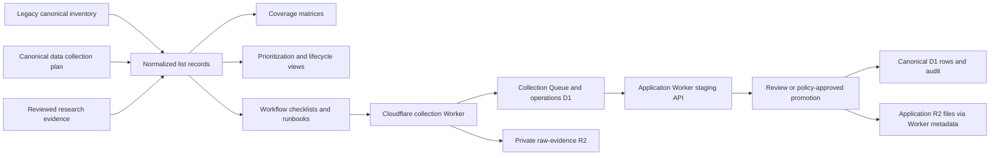

# Master list system architecture

This document defines how RoboPartPicker's planning lists remain stable, traceable, deduplicated, maintainable, and compatible with the current application trust boundary. It governs the list system in `docs/inventories/`. It does not change the canonical ingestion contract, approve scraping, or authorize production catalog writes.

## Architecture summary

The list system is a registry of planning knowledge derived from the preserved legacy inventory, the canonical data collection plan, and future reviewed research.



The central rule is preserve first, project second. `legacy-canonical-inventory.txt` remains immutable evidence. Markdown lists are human-readable projections. A future structured registry may become the source for generated Markdown views, but it must preserve all stable IDs, aliases, evidence, owners, and lifecycle history.

## Authority and trust boundary

| Layer | Authority | Can approve collection? | Can write canonical catalog data? |
|---|---|---:|---:|
| `docs/robopartpicker-data-collection-plan.md` | Canonical planning authority for provenance, policy, cost, ingestion, rollout, and review. | Defines required gates. | No. |
| `legacy-canonical-inventory.txt` | Immutable historical scope evidence. | No. | No. |
| Normalized inventory docs | Navigable planning projections and expansions. | No. | No. |
| Cloudflare collection Worker | Scheduled acquisition, deterministic adapters, parsing, normalization, health evaluation, and bounded batch submission. It may use collection-operations D1 and private raw-evidence R2 only. | No. | No. |
| Application Worker | Trusted API, authentication, authorization, validation, staging, application-file metadata, review gates, promotion, and audit. | Enforces approved decisions. | Yes, only through typed repositories and review or policy gates. |
| Operations D1 and raw-evidence R2 | Collection schedules, runs, health, incidents, checkpoints, and policy-approved raw evidence. | No, storage only. | No canonical writes. |
| Canonical D1 and application R2 | Reviewed relational product data and authorized application files. | No, storage only. | Canonical D1 through the Application Worker only. |

The Application Worker boundary from `/home/lenovo/robopartpicker/docs/backend-architecture.md` remains intact: no browser-to-database path, no collection Worker direct canonical D1 or application-file R2 writes, no broad CORS, no runtime migrations, no unrestricted SQL tools, and no production data touched by ordinary local development. The collection Worker runs on Cloudflare and reaches canonical data only through the bounded ingestion service.

## Stable IDs

Every normalized item gets one stable ID that survives renames, aliases, category moves, and lifecycle changes.

### ID namespaces

| Namespace | Pattern | Represents | Example |
|---|---|---|---|
| Source | `src:<slug>` | A canonical source identity or source family candidate. | `src:digikey` |
| Source alias | `alias:<source-slug>:<alias-slug>` | A historical label, brand, domain, or spelling. | `alias:robotis:dynamixel-docs` |
| Collection object | `obj:<domain>:<slug>` | Entity, observation, claim, file, relationship, or workflow object. | `obj:component:actuator` |
| Field or predicate | `field:<object-slug>:<field-slug>` | A collectable value or relationship predicate. | `field:offer:stock-status` |
| Tool | `tool:<slug>` | Parser, acquisition method, storage platform, QA utility, or workflow tool. | `tool:python-httpx` |
| Skill | `skill:<slug>` | Installed or proposed Jcode/custom skill. | `skill:agent-reach` |
| Role | `role:<slug>` | Human or agent operating role. | `role:source-researcher` |
| Workflow | `wf:<slug>` | Checklist, runbook, or gate sequence. | `wf:source-onboarding` |
| Risk | `risk:<slug>` | Stop condition or risk-register item. | `risk:policy-mismatch` |
| Decision | `decision:<date>:<slug>` | Approval, denial, lifecycle transition, or architecture choice. | `decision:2026-08-06:preserve-legacy` |

### ID rules

- IDs are lowercase, ASCII, hyphenated, and never reused for a different concept.
- Rename by changing `name`, not by changing `id`.
- Merge by retaining the winning ID and adding the losing ID to `merged_from`; do not delete the losing record's history.
- Split by retaining the original as an umbrella, alias, or retired ambiguous record, then creating new child IDs with `split_from`.
- Retire by lifecycle state, not by removing the ID.
- Legacy section references and line ranges are evidence fields, not stable IDs.

## Shared metadata envelope

Every structured record should eventually carry this envelope, even if the current Markdown projection only shows part of it.

```yaml
id: src:example
record_type: source
name: Example Robotics
summary: Official product and documentation source.
aliases:
  - Example Robot Docs
legacy_refs:
  - inventory_section: "2. Actuators, motors, and integrated joints"
    legacy_label: Example Robot Docs
source_family: manufacturer_documentation
status:
  lifecycle: researching
  disposition: approval-needed
  policy_state: review-needed
  technical_readiness: unsampled
ownership:
  primary_owner: source-researcher
  reviewer: review-operator
  steward: collection-engineer
provenance:
  created_at: "2026-08-06"
  updated_at: "2026-08-06"
  verified_at: null
  evidence_urls: []
  evidence_hashes: []
  confidence: speculative
relationships:
  covers_objects: []
  uses_tools: []
  blocked_by: []
  supersedes: []
  superseded_by: []
maintenance:
  cadence: quarterly
  stale_after_days: 90
  next_review_at: null
  change_notes: []
```

## Lifecycle model

Source and work-item lifecycle values match the prioritization framework:

1. `discovered`: named but not researched.
2. `researching`: identity, authority, access, policy, and coverage are being verified.
3. `candidate`: enough evidence exists to request approval, but collection is still disabled.
4. `approved`: bounded scope, policy review, budgets, fixtures, owner, and stop conditions are approved.
5. `pilot`: collection is running under explicit pilot limits.
6. `active`: recurring collection is explicitly promoted after pilot evidence.
7. `paused`: execution is stopped pending incident, stale review, drift, cost, or owner action.
8. `denied`: automated or scoped collection is prohibited by reviewer decision or policy evidence.
9. `manual-only`: value may be collected or reviewed manually, but not by automated collection.
10. `link-only`: retain metadata and references only, without mirroring or extracting disallowed content.
11. `retired`: no active use remains, but history, aliases, and audit links persist.

Disposition and policy state are separate fields. A source can be `researching` with `manual-only` disposition, or `active` for one scoped interface while `link-only` for another content class.

## Structured registry evolution

The current system is Markdown-first. The target architecture is registry-first with generated Markdown views.

### Phase 0: Preserved evidence

- Keep `legacy-canonical-inventory.txt` verbatim and hash-pinned.
- Keep `legacy-source-index.md` as a human-readable projection of legacy labels.
- Record that legacy scope is evidence of possibility, not permission.

### Phase 1: Markdown records with stable IDs

- Add stable IDs in tables or YAML blocks as lists mature.
- Use consistent lifecycle, owner, stale, source-family, object, field, tool, skill, and risk vocabularies.
- Add changelog entries for material additions, merges, splits, denials, and retirements.

### Phase 2: Sidecar YAML or JSON registries

Candidate files:

- `registries/sources.yaml`
- `registries/objects.yaml`
- `registries/fields.yaml`
- `registries/tools.yaml`
- `registries/skills.yaml`
- `registries/roles.yaml`
- `registries/workflows.yaml`
- `registries/risks.yaml`
- `registries/relationships.yaml`
- `registries/decisions.yaml`

Rules:

- The registry stores each fact once.
- Markdown files become generated or manually synchronized views.
- Cross-list membership uses relationships and tags, not duplicate records.
- Validation checks required fields, enum values, duplicate aliases, broken links, stale dates, and orphaned relationships.

### Phase 3: Application-aligned staging metadata

When implementation begins, registry IDs can map to Worker-side source registry tables and staging schemas. The mapping must remain explicit:

- Planning IDs are stable list identities.
- Application IDs are database records controlled by migrations and repositories.
- External collector run IDs and batch IDs are operational events.
- Canonical entity IDs are promoted catalog identities.

No phase allows the external collector or list registry to write canonical D1 records directly.

## Deduplication and aliases

Deduplication is evidence-driven and reversible.

### Source deduplication keys

Use a weighted evidence set:

- canonical domain or repository owner
- publisher/operator identity
- legal organization or brand owner
- official documentation links between domains
- redirect history and canonical links
- product identifiers and manufacturer part numbers
- legacy labels and section co-occurrence
- language and regional variants
- archive/mirror status

### Deduplication process

1. Search IDs, names, aliases, domains, repository locators, and legacy labels.
2. If a clear existing identity exists, add an alias and evidence instead of creating a new source.
3. If sources may be related but evidence is incomplete, create a conflict record with candidates.
4. If one record is a mirror, archive, distributor copy, regional branch, or acquired brand, represent that relationship explicitly.
5. If two records merge, preserve both histories and add `merged_from` or `supersedes`.
6. If one record splits, keep the original as retired ambiguous, umbrella, or legacy alias and create new precise records.

### Alias fields

Aliases should capture:

- alias text
- alias type: legacy label, brand, former name, domain, repository, product-line name, acquired name, spelling, regional name, mirror
- first seen date and evidence
- whether it is accepted, deprecated, ambiguous, or denied
- linked stable ID or unresolved candidates

## Source of truth and generation

| Artifact | Source of truth today | Target state | Generation rule |
|---|---|---|---|
| `legacy-canonical-inventory.txt` | Verbatim file | Same | Never generated or rewritten except by explicit preservation task. |
| `legacy-source-index.md` | Manual projection | Generated from legacy parser plus curated notes | Regenerate only when legacy inventory changes or parser improves. |
| `README.md` | Manual navigation | Generated from registry metadata plus manual introduction | Must reflect every list family. |
| `source-universe.md` | Planned researched list | Registry view | Generated from `sources.yaml` with manual notes allowed in fenced sections. |
| `collection-universe.md` | Planned ontology list | Registry view | Generated from objects, fields, and relationship registries. |
| `tools-and-skills.md` | Manual capability inventory | Registry view plus curated guidance | Regenerate tables from tools, skills, roles, and workflows. |
| `coverage-matrices.md` | Manual matrix | Generated relationship view | Derived from source-family, object, method, tool, and evidence relationships. |
| `prioritization-and-status.md` | Manual framework | Registry status view plus framework text | Score/status tables generated from lifecycle records. |
| `risks-and-stop-conditions.md` | Manual risk index | Registry view plus narrative | Risk records generated, hard-stop text curated and reviewed. |
| `workflow-checklists.md` | Manual checklists | Workflow registry plus curated checklist text | Steps versioned and linked to gates. |

Until generation tooling exists, updates must be manually reconciled across affected files.

## Owners and responsibilities

| Owner | Owns | Review cadence |
|---|---|---|
| Planning owner | Plan authority, list architecture, structural changes, and requirements alignment. | Monthly or after scope changes. |
| Data strategist | Collection universe, object/field taxonomy, matrices, and gap analysis. | Monthly. |
| Source researcher | Source universe, identity, policy evidence, aliases, and verification dates. | Per source cadence, with monthly stale sweep. |
| Collection engineer | Tools, parsers, acquisition methods, fixtures, runbooks, and collector boundaries. | Before pilot and after drift. |
| Review operator | Lifecycle decisions, approvals, denials, manual-only/link-only states, and promotion gates. | On every transition. |
| Security/policy owner | Hard stops, privacy, licensing, access controls, secrets, and incident response. | Quarterly or after incidents/terms changes. |
| QA/observability owner | Coverage metrics, validation checks, stale records, and dashboards. | Weekly during pilots, monthly otherwise. |
| Worker/API owner | D1/R2 schemas, staging API, validation, audit, and authorization. | Per implementation change. |

Each record should have one primary owner and, where risk exists, a separate reviewer.

## Cadences and stale rules

| Record family | Default cadence | Stale threshold | Immediate recheck triggers |
|---|---:|---:|---|
| Source identity and authority | Quarterly | 120 days | Redirect, acquisition, domain change, source dispute. |
| Robots, terms, license, reuse | Quarterly for candidates, monthly for pilot/active | 90 days or earlier if source requires | Terms change, robots change, complaint, new content class. |
| Access profile and rate limits | Monthly for pilot/active | 45 days | 401/403/429 spikes, CAPTCHA, API deprecation, pagination drift. |
| Object/field taxonomy | Monthly | 180 days | New entity class, schema gap, rejected batch pattern. |
| Tool and parser inventory | Quarterly | 180 days | Security advisory, version deprecation, repeated parser failure. |
| Fixtures and drift probes | Per release or monthly active source | 45 days | Parse yield drop, structural signature change, stale values. |
| Lifecycle status | Monthly | 45 days for active/pilot, 120 days otherwise | Incident, owner change, budget issue, reviewer decision. |
| Risk register | Quarterly | 180 days | Incident, new source class, new legal/security constraint. |
| Coverage metrics | Monthly | 45 days | Major source/object/list change. |

Stale does not mean wrong. It means the record cannot support new approvals or active automation until refreshed.

## Coverage metrics

Track list health and rollout readiness with explicit denominators.

### Registry completeness

- Percent of source records with stable ID, owner, lifecycle, disposition, source family, evidence URL, verification date, cadence, and stale threshold.
- Percent of legacy labels mapped to canonical source IDs, aliases, denied states, or unresolved conflicts.
- Percent of object and field records mapped to evidence class and accepted ingestion representation.
- Percent of tools and skills mapped to workloads, boundaries, and avoid conditions.
- Percent of workflows linked to roles, inputs, outputs, and stop conditions.

### Permission and policy readiness

- Count of sources by lifecycle and disposition.
- Candidate-to-approved conversion rate with reasons for denial or deferral.
- Active sources with current robots/terms/license evidence.
- Manual-only and link-only sources retained without accidental execution.

### Extraction and quality readiness

- Approved sources with adapter contract, parser contract, fixtures, replay tests, and drift probes.
- Parse success rate, rejection rate, evidence-locator completeness, and normalization error rate by source.
- Duplicate candidate rate and reviewer disagreement rate.
- Claim coverage by evidence class: official, user-reported, measured, calculated, estimated, AI-inferred.

### Operations and safety

- Runs by source, request count, bytes, cost, retries, and circuit-breaker events.
- Stale active records by owner.
- Incidents by risk category and time to pause.
- Withdrawal rehearsal pass rate.
- Secrets, personal-data, license, and unsafe-file findings.

## Migration from legacy inventory

The legacy inventory is preserved at SHA-256 `8626d7ea96f6ee901f31e808129762322fde3f31a1b400007155a57b144da42a`. Migration means creating projections, not replacing the evidence.

### Migration stages

1. **Parse sections.** Identify section number, title, source labels, object categories, and implied source families.
2. **Normalize labels.** Trim whitespace, unify obvious casing, preserve exact original text as `legacy_label`.
3. **Assign provisional IDs.** Generate IDs only after duplicate and alias checks.
4. **Classify source family.** Manufacturer, distributor, repository, forum, video, academic, archive, dataset, standards, regulatory, marketplace, or unknown.
5. **Map coverage.** Link source labels to probable objects and fields from the section context.
6. **Resolve aliases.** Merge labels such as product-line docs, manufacturer docs, regional domains, and repository organizations only with evidence.
7. **Set lifecycle.** Default legacy-derived records to `discovered` or `researching`, never `approved` or `active`.
8. **Record gaps.** Unknown domain, policy state, access method, license, cadence, and owner remain explicit unknowns.
9. **Generate views.** Update source index, source universe, collection universe, and matrices from the normalized records.
10. **Review sample.** Manually review a representative set from each section before bulk use.

### Legacy migration statuses

| Status | Meaning | Allowed next action |
|---|---|---|
| `unmapped` | Legacy label has no normalized record. | Create provisional source or mark not-a-source. |
| `mapped` | Label points to one stable ID. | Add evidence and lifecycle metadata. |
| `alias` | Label is an alias of another ID. | Preserve alias evidence. |
| `conflict` | Label could refer to multiple entities. | Research identity before use. |
| `not-a-source` | Label names a method, section, source family, or generic concept. | Convert to tag or object relationship. |
| `retired-legacy` | Historical label is no longer useful except as evidence. | Keep for traceability. |

## List maintenance workflow

### Add a source

1. Search all list files and future registries for name, alias, domain, repository, and legacy label.
2. Create or update one stable source record.
3. Record evidence URL, discovery date, source family, expected objects, owner, lifecycle, disposition, and open questions.
4. Add aliases and legacy references.
5. Update coverage relationships.
6. Set cadence and stale threshold.
7. Add a changelog entry.

### Add a collectable object or field

1. Locate the nearest entity, revision, observation, claim, measurement, file, or relationship type.
2. Define value type, units, temporal behavior, evidence class, applicable revision, and accepted ingestion representation.
3. Link source families and candidate tools.
4. Record schema gaps explicitly.
5. Add validation expectations and examples.

### Change lifecycle or disposition

1. Require named reviewer and evidence.
2. Record previous state, new state, scope, reason, timestamp, and affected records.
3. For pause, denial, manual-only, link-only, or retirement, ensure schedules, credentials, and runbooks cannot execute the old scope.
4. Preserve history and aliases.
5. Update status views and coverage metrics.

### Refresh stale records

1. Generate stale report by owner and family.
2. Recheck identity, access, robots, terms, license, cost, cadence, and linked tools.
3. Record what changed, what did not change, and evidence timestamps.
4. Recompute scores and lifecycle eligibility.
5. Escalate records that cannot be refreshed before active use.

## Migrations and schema changes

List schema changes must be handled like application migrations, even while stored in Markdown/YAML.

- Create a migration note with date, owner, reason, affected fields, compatibility impact, and rollback plan.
- Provide deterministic transformation rules for existing records.
- Keep deprecated fields readable until generated views no longer need them.
- Validate that stable IDs, aliases, legacy references, lifecycle, owners, and evidence survive the migration.
- Recompute coverage metrics and stale reports after migration.
- If a list schema maps to the Worker ingestion contract, coordinate with Worker migrations and staging validators. Do not assume a documentation-field rename changes application behavior.

## Validation gates

Before treating list changes as complete:

- Markdown renders with headings, tables, links, and code fences intact.
- Required files listed in `README.md` exist or are clearly marked planned.
- New IDs are unique and stable.
- Links between lists are relative and valid.
- Lifecycle, disposition, policy state, confidence, evidence class, and source-family values use approved vocabularies.
- Every new source has owner, evidence, cadence, stale threshold, lifecycle, and disposition, or an explicit unknown.
- No source is marked approved, pilot, or active without required approval evidence.
- No command pattern writes directly to canonical D1/R2 or bypasses the Worker.
- No secret, token, account credential, private URL, or production binding is embedded in docs.

## Open implementation decisions

These are intentionally unresolved until separate approval:

- Exact YAML/JSON registry schema and validation CLI.
- Whether Markdown becomes fully generated or remains curated with generated sections.
- Scoring weights beyond the current equal provisional dimensions.
- Worker database table names for source registry, staging batches, review decisions, and coverage metrics.
- Whether Durable Objects, Workflows, Queues, or an external scheduler own orchestration state.
- Pilot source selection and any paid API/source budget.
