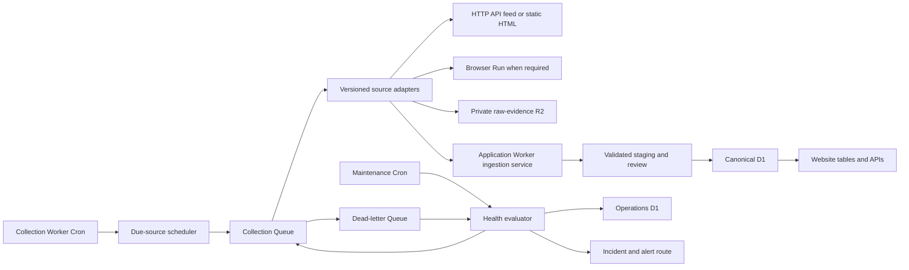

# Cloudflare-first scraping and collection operations plan

## Executive decision

RoboPartPicker collection will run on Cloudflare. Normal operation will not depend on a laptop, a manually initialized AI agent, GitHub Actions schedules, or a dedicated server.

The initial production system will use the smallest useful Cloudflare stack. Exact binding names, Operations D1 tables, Queue messages, leases, R2 keys, and the Application Worker handoff are defined in [`../architecture/collection-runtime-contract.md`](../architecture/collection-runtime-contract.md):

1. One collection Worker for scheduling, adapter execution, queue consumption, and health evaluation.
2. One Cloudflare Queue plus a dead-letter queue for durable jobs, retry control, and load smoothing.
3. One small operations D1 database for source configuration, schedules, run history, adapter health, incidents, and checkpoints.
4. One private R2 bucket or private prefix for policy-approved raw evidence and failed-run diagnostics.
5. Cloudflare Browser Run only for approved sources that genuinely require JavaScript rendering.
6. The existing application Worker and canonical D1 ingestion boundary for validation, staging, review, promotion, and website reads.

Cloudflare Workflows, Durable Objects, Containers, AI agents, a separate analytics platform, and a dedicated server are not initial dependencies. Each may be added only when measured requirements justify it.

## Product principles

- **Cloudflare-hosted:** recurring collection runs remotely even when every developer laptop is off.
- **Deterministic by default:** every active source has a versioned adapter that can be invoked repeatedly without an AI agent.
- **AI outside the critical path:** AI may help investigate or propose a repair, but it does not perform routine scraping, approve its own patch, deploy itself, or write canonical data.
- **One scheduler, not one cron per site:** source cadence is data in the registry. A shared scheduler dispatches whichever sources are due.
- **Fail closed:** uncertain policy, authentication changes, CAPTCHA, structural drift, unsafe files, and semantic corruption pause the affected source.
- **Source-local failure isolation:** one broken adapter does not stop unrelated sources.
- **Raw evidence before interpretation:** policy-approved source evidence and retrieval metadata are retained before normalization.
- **Simple publication path:** the website reads reviewed canonical D1 records through the existing Worker. No separate warehouse, search cluster, or publication database is required for ordinary comparison tables.
- **Prove need before adding infrastructure:** operational complexity must be justified by observed workload, not hypothetical future scale.

## Runtime topology



## Cloudflare component responsibilities

| Component | Required responsibility | Explicit non-responsibility |
|---|---|---|
| Collection Worker | Cron handlers, source selection, Queue producer and consumer, deterministic adapters, bounded parsing, health rules, and service-bound ingestion submission. | It does not promote canonical records or expose public catalog APIs. |
| Collection Queue | Durable delivery, bounded retries, batching, backpressure, and source-run work distribution. | It does not carry raw pages, large documents, or secrets. Messages contain identifiers and R2 references. |
| Dead-letter Queue | Retain terminally failed job pointers for inspection and replay after repair. | It is not an infinite retry loop. |
| Operations D1 | Source registry, priorities, schedules, adapter versions, run state, metrics, health state, incidents, leases, and checkpoints. | It is not the public product catalog. |
| Raw-evidence R2 | Policy-approved response bytes, hashes, manifests, parser fixtures, and quarantined failure samples. | It is not a public mirror of third-party sites. |
| Browser Run | Render and inspect approved dynamic pages when HTTP or structured interfaces are insufficient. | It is not an anti-bot bypass and is not the default acquisition method. |
| Application Worker | Authenticate the collector through an internal service boundary, validate batches, stage data, detect conflicts, enforce review rules, promote approved records, and serve website reads. | It does not crawl websites. |
| Canonical D1 | Reviewed manufacturers, components, offers, observations, claims, relationships, projects, builds, provenance, and website-facing read models. | It does not store arbitrary raw page bodies. |
| Workers Logs | Invocation, cron, queue, error, and structured run logs. | Logs are not the sole durable source-run ledger. |

## Why a dedicated server is not the starting point

A dedicated server would add patching, operating-system security, uptime monitoring, process supervision, networking, backups, credential management, scaling, and failover before the workload proves that any of those costs buy useful capability.

The present workload is primarily scheduled HTTP requests, structured parsing, bounded browser rendering, queue processing, and relational or object storage. Cloudflare already provides those primitives. Cloudflare Cron Triggers are explicitly intended for periodic jobs and calling third-party APIs. Queues provide durable delivery and dead-letter handling. Browser Run provides managed Playwright or browser extraction. Containers provide a later Cloudflare-hosted path for full Linux or non-Worker runtimes.

### Escalation order

1. Optimize or split the adapter within Workers.
2. Use Browser Run for the smallest browser-dependent portion.
3. Add Cloudflare Workflows only when a source run needs a durable multi-step sequence that is materially clearer than Queue messages and D1 checkpoints.
4. Add Cloudflare Containers only when an approved adapter requires a full runtime, native package, filesystem, greater memory or CPU, or an existing OCI workload.
5. Consider a dedicated external server only after Cloudflare Workers, Browser Run, and Containers have been tested against the real workload and a documented constraint remains.

### Dedicated-server admission criteria

A server proposal must include measured evidence for at least one of these conditions:

- an approved source requires a stable network property, protocol, or long-lived session that the selected Cloudflare products cannot provide
- the necessary parser or converter cannot run safely in Workers or Cloudflare Containers
- three months of measured Cloudflare collection cost is at least twice the fully burdened managed-server cost at equal reliability, including maintenance labor
- persistent local state is technically required and cannot be checkpointed to D1 or R2
- Cloudflare product limits cause repeated missed freshness targets after adapter optimization and approved limit increases have been evaluated
- a contractual data-residency or network requirement cannot be met on the selected Cloudflare deployment

Until one of these is demonstrated, there is no dedicated scraper server.

## Acquisition method order

Every source uses the least complex approved method that is reliable:

1. Documented API.
2. Feed, export, sitemap, or structured dataset.
3. Repository API, release asset, or bounded file reference.
4. Static HTTP HTML with JSON-LD, embedded JSON, semantic tables, or stable markup.
5. Browser Run Quick Action for a simple rendered extraction.
6. Browser Run Playwright session for a narrowly bounded interaction.
7. Cloudflare Container for an approved full-runtime requirement.
8. Manual-only or link-only when automation is not policy-compatible or technically safe.

An adapter must not escalate methods merely to increase coverage. Authentication, paywalls, CAPTCHAs, deliberate anti-automation controls, and policy restrictions are stop conditions, not engineering challenges to bypass.

## Versioned adapter contract

Every active source must have a durable adapter package with these capabilities:

- `source profile`: canonical source ID, approved domains and paths, method, policy revision, locale, cadence, request budget, byte budget, and cost class
- `discover`: enumerate bounded stable resource identifiers without unrestricted crawling
- `fetch`: apply conditional requests, timeouts, retry limits, redirect checks, rate limits, and response-size limits
- `snapshot`: hash and store permitted evidence or a snapshot reference before parsing
- `extract`: parse deterministic source fields and preserve exact source locators
- `normalize`: map values, units, identifiers, revisions, dates, currencies, and missing states into the ingestion contract
- `validate`: reject malformed records and semantic invariants before submission
- `submit`: call the application ingestion boundary with idempotency and bounded batches
- `health`: emit standard transport, structure, extraction, semantic, freshness, and cost measurements
- `fixtures`: include representative normal, missing, discontinued, changed-template, and malformed samples
- `canary`: identify at least one stable resource or query that can reveal adapter breakage cheaply
- `version`: record adapter code version, fixture version, schema version, and last-known-good run

Routine execution loads the registered adapter version and calls it. It never generates scraper code during the run.

## Source prioritization

### Eligibility gates

A source cannot enter the implementation queue until all are true:

- its canonical identity and authority class are known
- the exact target domains, paths, interfaces, and desired fields are known
- policy, robots, license, reuse, authentication, and personal-data states are reviewed for the proposed scope
- the source maps to a current product-data gap
- a bounded acquisition method exists
- raw evidence, provenance, withdrawal, and source-local pause are possible
- expected requests, bytes, browser time, storage, and paid cost are estimated

Ineligible sources remain visible as research, manual-only, link-only, denied, or deferred. They do not receive a misleading numerical implementation score.

### Priority score

Score each eligible source from 0 to 5 on each input:

```text
priority =
  4 * product_value
+ 3 * authority_and_evidence_quality
+ 3 * current_coverage_gap
+ 2 * access_stability
+ 2 * adapter_reuse_value
+ 1 * freshness_need
- 3 * policy_risk
- 2 * implementation_effort
- 2 * expected_maintenance
- 1 * recurring_cost
```

The score is a sorting aid, not an approval. Every input records confidence and evidence. A new source is preferred when it closes an important data gap and creates an adapter family reusable across many later sources.

### Work-order rules

1. Finish the shared adapter runtime, fixture system, health contract, and ingestion path before building many source adapters.
2. Build one source at a time until the first adapter family has passed pilot health thresholds.
3. Then parallelize sources only when they use an already-proven adapter family or have independent ownership.
4. Keep no more than three new source adapters in active development at once.
5. Fix a degraded high-priority active adapter before starting a lower-priority source, unless the incident is explicitly deferred.
6. Recompute priorities monthly and whenever a policy, interface, major product requirement, or coverage gap changes.

### Default source-family order

1. Official manufacturer APIs, exports, stable catalogs, and documentation.
2. Authorized distributor APIs or structured exports with price and stock observations.
3. Official open-source repositories, releases, BOMs, robot descriptions, and documentation.
4. Public standards, research datasets, certification records, and structured fabrication-service catalogs.
5. Additional official manufacturers and distributors that reuse proven adapter families.
6. Policy-compatible community build evidence with strong provenance and moderation controls.
7. Volatile marketplaces, browser-heavy sources, and weakly structured community content.

This ordering deliberately postpones the most fragile and expensive adapters until the collection system has demonstrated reliable health detection and provenance.

## Scheduling model

### Collection dispatcher

A shared Cron Trigger runs every few minutes. It performs only bounded orchestration:

1. Query Operations D1 for enabled sources whose `next_run_at` is due.
2. Skip paused, policy-stale, budget-blocked, leased, or unhealthy sources.
3. Acquire a source lease and create a run record.
4. Enqueue one small source-run pointer.
5. Advance `next_run_at` only according to the recorded run outcome policy.

The Cron handler does not perform a full crawl. Queue consumers perform acquisition and parsing under per-source concurrency and budget limits.

### Maintenance sentinel

A second Cron Trigger on the same Worker runs hourly. It does not need an AI agent. It:

1. Finds overdue, stuck, repeatedly failing, policy-stale, or freshness-breached sources.
2. Checks queue age, retry counts, dead-letter arrivals, and unfinished leases.
3. Evaluates extraction and semantic metrics against the adapter baseline.
4. Enqueues a cheap canary run when a source is due for one.
5. Expires abandoned leases safely.
6. Changes source health state using deterministic rules.
7. Opens or updates one incident per source and failure signature.
8. Sends one deduplicated alert when human attention is required.

A daily summary can report active sources, successes, failures, stale data, paused adapters, dead letters, browser use, and costs. This summary is optional at launch. The hourly health state and immediate hard-stop alerts are required.

### Alert delivery contract

Operations D1 is the durable source of truth for incidents. Workers Logs is the diagnostic stream. A live source additionally requires one operator-owned HTTPS alert destination stored as the `COLLECTION_ALERT_WEBHOOK_URL` Worker secret.

The sentinel sends a bounded JSON `POST` containing `incidentId`, `sourceId`, `severity`, `state`, `signature`, `firstSeenAt`, `lastSeenAt`, `runId`, `traceId`, and a non-secret operator summary. It never sends raw source bodies, credentials, arbitrary provider errors, or R2 bytes.

- Deduplication key: `sourceId + signature + lifecycle`.
- Warning or degraded incident: notify on open, then at most once per 24 hours while unresolved.
- Critical, paused, denied, DLQ, policy, credential, provenance, or suspected secret incident: notify immediately and once again after 60 minutes if unacknowledged.
- Recovery: send one resolved notification after a passing canary and recorded operator resume.
- Webhook failure: retain the incident, record delivery attempts, retry twice through the same bounded Queue policy, and expose `alert_delivery_failed` to the sentinel.
- Missing production alert secret: source cannot reach `approved_live`.

The concrete destination address and human owner belong in the private deployment record, not this repository. Preview uses a fixture endpoint or an explicitly approved non-production destination.

### Pilot service objectives

These are operational objectives, not promises about an external source:

| Objective | Target | Evaluation and action |
|---|---:|---|
| Scheduled dispatch | 99% of eligible cadence slots enqueue within 15 minutes | Degraded after one miss, paused after two consecutive misses. |
| Run completion | 95% of eligible runs reach success, approved unchanged, or reviewed partial within 30 minutes | Investigate by source and platform failure class. |
| Freshness | No approved active source exceeds 1.5 times cadence without a degraded incident | Pause at twice cadence. |
| Evidence durability | 100% of submitted records have immutable evidence hash and manifest | Immediate hard stop below 100%. |
| Ingestion integrity | 100% of submitted batches validate; zero unexplained partial canonical writes | Immediate hard stop on invariant failure. |
| Incident detection | Sentinel opens a qualifying incident within 60 minutes | Treat a missed evaluation as a platform incident. |
| Critical alert delivery | First attempt within 5 minutes of incident creation; delivery or explicit failure within 15 minutes | Missing delivery blocks live operation. |
| Duplicate safety | Zero duplicate import, revision, spec, or observation rows from retry or replay | Immediate pause and repair. |

Review objectives after four weeks of pilot data. Do not weaken evidence, integrity, or duplicate-safety targets based on averages.

### Pilot cost and usage stops

The initial budget is a control limit, not a forecast:

- paid provider API allowance: USD 0 unless separately approved in the source profile
- total Cloudflare incremental pilot budget: USD 10 per calendar month warning at 50%, source-local pause at 80% when attributable, and global collection pause at 100%
- per-source logical request, byte, R2 growth, Queue operation, and execution-duration ceilings remain mandatory even when account billing is below the dollar threshold
- Browser Run, Workers AI, Containers, and paid proxy traffic have a zero budget and zero binding in the initial runtime
- a budget reset requires a new period or recorded operator override with owner, reason, amount, and expiry

Because Cloudflare billing exports can lag, the runtime also enforces request and byte ledgers synchronously. Billing observations confirm the ledger rather than replacing it.

### Operator views

Do not add an observability vendor for the pilot. Provide saved D1 queries or views for:

- active-source health, policy expiry, next run, and lease state
- latest run and last successful run per source
- open incidents and alert-delivery state
- Queue retries and dead letters
- request, byte, execution, storage, and estimated cost usage by source and month
- freshness debt and baseline drift

Workers Logs are queried by `sourceId`, `runId`, `traceId`, and `event`. The operator runbook must include the exact Wrangler commands for each view before live activation.

## Automatic breakage detection

### Required health signals

| Signal family | Examples |
|---|---|
| Transport | DNS failure, timeout, redirect change, status distribution, 401, 403, 404, 429, CAPTCHA or challenge signature, MIME change, response bytes, latency. |
| Structure | Missing selectors or JSON paths, changed JSON schema, DOM structural fingerprint, missing pagination controls, template distribution change. |
| Extraction | Items discovered, items parsed, parse failures, required-field yield, duplicate ratio, page-to-record yield, empty result from a normally non-empty source. |
| Semantic | Invalid identifiers, impossible units, currency mismatch, price or dimension outliers, revision collisions, broken relationships, ingestion rejection rate. |
| Freshness | Last successful observation, expected cadence, unchanged-response streak, source timestamp lag, overdue run age. |
| Operations | Queue age, attempts, DLQ count, lease age, run duration, request count, bytes, browser minutes, storage growth, paid calls. |
| Policy | Robots or terms evidence age, approval expiry, new authentication requirement, disallowed redirect, changed license signal. |
| Canary | Known stable item or query still exists and yields its minimum identity fields. |

### Initial health-state rules

Thresholds are defaults and become source-specific after a pilot baseline.

| State | Initial rule | Automated action |
|---|---|---|
| `healthy` | Last scheduled run succeeded and key metrics are inside the approved baseline. | Continue normal cadence. |
| `suspect` | One transient run failure, a moderate metric deviation, or a canary warning occurs without corruption risk. | Keep prior canonical data, retry within budget, and increase observation. |
| `degraded` | Two consecutive failures, required-field yield drops materially, extraction count moves outside its baseline, or freshness exceeds 1.5 times cadence. | Stop automatic promotion, reduce concurrency, preserve diagnostics, and alert. |
| `paused` | Three consecutive failures, any DLQ arrival, freshness exceeds twice cadence, required identity yield falls below the adapter minimum, or a hard-stop signal appears. | Stop scheduling the source and require a verified repair or policy review. |
| `denied` | Policy review prohibits the collection scope. | Remove schedules and credentials while retaining audit history. |
| `retired` | Source is intentionally removed or permanently replaced. | Disable schedules and retain lineage and withdrawal state. |

### Immediate pause signals

Pause without waiting for repeated failures when any of these appears:

- 401, 403, CAPTCHA, abuse notice, or new login requirement outside approved behavior
- robots, terms, license, or reviewer scope conflict
- redirect to an unapproved domain or path
- parser output can plausibly corrupt identity, revision, unit, currency, compatibility, price, or availability
- response type, archive behavior, or file contents violate safety limits
- secrets or unnecessary personal data enter logs or artifacts
- source or global request, byte, browser-time, storage, or cost budget is reached
- raw evidence, provenance, idempotency, or withdrawal traceability fails

## Repair and maintenance workflow

```mermaid
flowchart LR
  detect[Deterministic detection] --> pause[Pause source or promotion]
  pause --> incident[Incident package]
  incident --> diagnose[Human or AI-assisted diagnosis]
  diagnose --> patch[Adapter and fixture patch]
  patch --> tests[Offline fixtures and regression tests]
  tests --> shadow[Cloudflare shadow or canary run]
  shadow --> approve[Human review and deploy]
  approve --> resume[Resume source]
```



The incident package contains the run ID, source ID, adapter version, failure signature, bounded logs, metrics, response metadata, permitted failed sample or R2 reference, last-known-good fixture, and structural diff.

Jcode, Hermes, or another agent may consume this package and propose a code change. The agent cannot receive production write credentials, change the source policy decision, merge its own patch, deploy automatically, or resume a paused source. The repaired adapter must pass fixtures, regression tests, contract validation, and a Cloudflare canary or shadow run before an operator resumes it.

## Data organization for website publication

The data path remains intentionally straightforward:

1. Raw evidence and retrieval manifests live privately in R2.
2. Source configuration, runs, adapter health, incidents, and checkpoints live in Operations D1.
3. Parsed batches cross the internal ingestion boundary.
4. The application Worker validates and stores raw import records and typed staging records.
5. Review or a narrowly approved deterministic policy promotes records to canonical D1 tables.
6. Mutable facts such as price, stock, availability, firmware, and source status remain append-only observations.
7. The website uses bounded indexed D1 queries or small denormalized read views to render tables.

Do not add a separate data warehouse, Elasticsearch, vector database, event lake, GraphQL layer, or second publication store until a measured website requirement cannot be met by D1 and R2.

## Initial delivery sequence

### Phase 0: reconcile the plan

- Replace the external-laptop and GitHub Actions scheduler assumptions with this Cloudflare-first decision.
- Keep the existing ingestion trust boundary and canonical schema work.
- Convert the source universe into eligible, scored source records. The first applied queue is [`../inventories/first-wave-source-queue.md`](../inventories/first-wave-source-queue.md).

### Phase 1: minimum collection runtime

- Deploy the Collection Worker with disabled schedules using the [`collection runtime contract`](../architecture/collection-runtime-contract.md).
- Create Operations D1, the Collection Queue, the dead-letter queue, and private raw-evidence R2 storage.
- Implement source registry, leases, run records, budgets, structured logs, and the internal ingestion service call.
- Verify fixture-only runs in Cloudflare staging.

### Phase 2: adapter SDK and first official source

- Implement one deterministic HTTP or API adapter family.
- Add fixtures, canary, baseline metrics, evidence capture, normalization, and contract submission.
- Select the highest provisional implementation-readiness official source, then keep it disabled until every live gate passes. The initial evidence-backed queue selects `ROBOTIS-GIT/emanual` and the bounded DYNAMIXEL X-series packet in [`../adapter-specs/robotis-emanual-x-series.md`](../adapter-specs/robotis-emanual-x-series.md).
- Run shadow collection before canonical promotion.

### Phase 3: sentinel and repair loop

- Enable hourly maintenance evaluation.
- Exercise transport failure, structural drift, empty extraction, semantic rejection, cost stop, DLQ, pause, repair, canary, and resume.
- Confirm alerts are deduplicated and source-local.

### Phase 4: prioritized five-source pilot

- Add sources in score order, favoring reuse of proven adapter families.
- Include official manufacturer, structured distributor, official repository or BOM, and two additional high-value eligible sources.
- Do not force a volatile marketplace into the first five if policy or maintenance evidence makes it a poor priority.

### Phase 5: simple website read models

- Add only the indexed queries and read shapes needed for product comparison tables.
- Expose provenance and freshness where useful.
- Measure before adding caches, search services, or analytics infrastructure.

## Launch success criteria

- No scheduled collection requires a developer laptop, manual shell session, or AI-agent initialization.
- One shared scheduler runs all enabled source cadences.
- Every active source has a versioned deterministic adapter, fixtures, a canary, baseline health thresholds, a kill switch, and a named owner.
- Queue retry and dead-letter behavior is tested without duplicate imports or canonical observations.
- Structural and semantic breakage is detected before corrupted records are promoted.
- A failed source pauses independently and produces one actionable incident package.
- A repaired adapter passes offline fixtures and a Cloudflare canary before resuming.
- The first five sources are selected by recorded eligibility and priority evidence.
- Every displayed value retains source, retrieval time, adapter version, applicable revision, and evidence classification.
- Website comparison tables are served from canonical D1 through the existing Worker without an unnecessary secondary backend.
- Browser Run, Containers, Workflows, AI, and any dedicated server are used only when their admission criteria are met.

## Authoritative Cloudflare references

Verified on 2026-08-06:

- Cron Triggers: <https://developers.cloudflare.com/workers/configuration/cron-triggers/>
- Cloudflare Queues: <https://developers.cloudflare.com/queues/>
- Queue batching, retries, and dead-letter behavior: <https://developers.cloudflare.com/queues/configuration/batching-retries/>
- Workers Logs: <https://developers.cloudflare.com/workers/observability/logs/workers-logs/>
- Browser Run: <https://developers.cloudflare.com/browser-run/>
- Browser Run limits: <https://developers.cloudflare.com/browser-run/limits/>
- Cloudflare Workflows: <https://developers.cloudflare.com/workflows/>
- Workflow limits: <https://developers.cloudflare.com/workflows/reference/limits/>
- Cloudflare Containers: <https://developers.cloudflare.com/containers/>
- Container limits: <https://developers.cloudflare.com/containers/platform-details/limits/>
- D1: <https://developers.cloudflare.com/d1/>
- R2: <https://developers.cloudflare.com/r2/>
